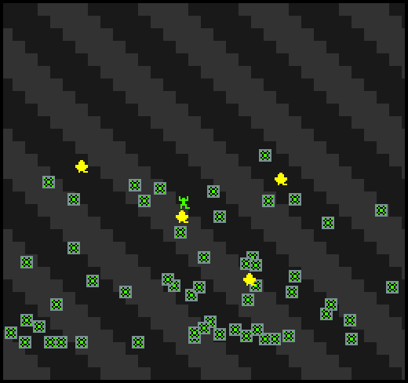

# Gravity Man

Author: Tyler Thompson

Design: This game functions basically as a reverse platformer in which the player must grab stars without hitting any mines by changing gravity. Unlike a traditional platformer, all the "platforms" in this game are meant to be avoided.

Screen Shot:

How Your Asset Pipeline Works:

My asset pipeline starts by reading in PNG files. It reads all files from the resources directory and treats them as PNG spritesheets where each sprite is 8x8 pixels. If the file is named with something that marks it as being special (having background in the name, player in the name, etc), then the contents of the PNG are stored in specific locations in the palette table and the tile table so that they can be specifically accessed later. This is done in the file load_resources.cpp. Once load_resources.cpp has read every PNG in resources and stored them in palette/tile tables, PlayMode.cpp then uses those sprites as part of the game!

How To Play:

The goal is to get the stars without touching the mines. Use the left and right arrow keys to move side to side and the up arrow key for a short jump. However, the most important key is the space bar, which switches gravity. Gravity can be switched while in the air.

Sources: I created all sprite assets myself using Photopea (honestly not the best way to make sprites, I wouldn't suggest it). Any code I used is referenced by in-line comments. The only things I used that were more than a few (usually edited) lines from StackOverlow or the like was data_path.cpp and data_path.hpp. THese files are from the 2019 game 1 base code and were provided by Jim McCann as part of the assets reading.

This game was built with [NEST](NEST.md).

